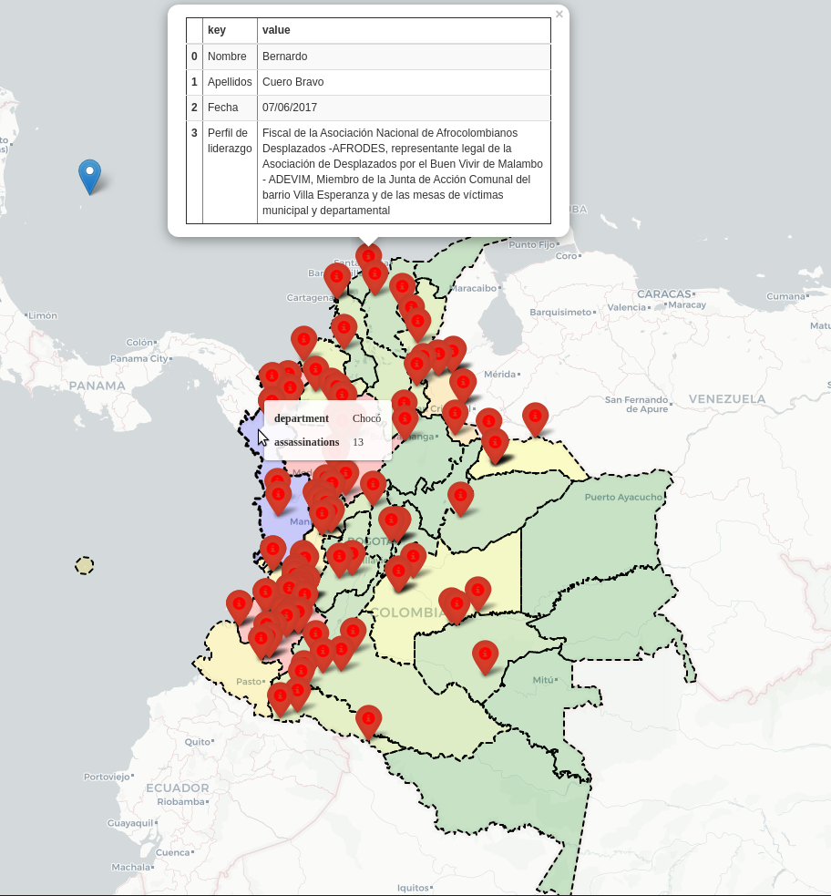

# Visualizing Data concerning Homocides of Social Leaders in Colombia
data taken from [https://www.queremosdatos.co/](https://www.queremosdatos.co/)  

see [request for number of killed sociel leaders](https://www.queremosdatos.co/request/numero_de_lideres_sociales_muert)
### setup
    conda create -n opendatavis python=3.7
    source activate opendatavis
    pip install -r requirements.txt
    
## 1. [pdf parsing](getting_data.py)
parse [Homicidios2017 2018FINAL.pdf](https://www.queremosdatos.co/request/418/response/856/attach/6/Homicidios2017%202018FINAL.pdf) with [camelot](https://github.com/atlanhq/camelot.git) receive [data.jsonl](data.jsonl)

    a small subset of the table: 
        
          Municipio        Apellidos       Fecha
        0    Carepa  Cartagena Úsuga  10/01/2017
        1    Sonsón   Alzate Londoño  12/01/2017
        2    Jardín    Suárez Osorio  22/01/2017
        
## 2. [visualize departments](visualize_departments.py)

[departments.csv](colombia_departments.csv) copy-pasted from [statoids](http://www.statoids.com/uco.html)

get department-borders (geo-coding) from [nominatim](https://nominatim.org/release-docs/develop/api/Search/) and visualize with [folium](https://github.com/python-visualization/folium.git)

## 3. [mark locations of assassinations](opendata_visualization/locations_of_assassinations_of_social_leaders.py)
geo-coding of cities via [nominatim](https://nominatim.org/release-docs/develop/api/Search/) geojsons are written to [municipios.json](municipios.json)
each assassination gets a marker with pop containing information from [Homicidios2017 2018FINAL.pdf](https://www.queremosdatos.co/request/418/response/856/attach/6/Homicidios2017%202018FINAL.pdf)  
marker locations are NOT exact!

## 4. [color departments by number of killed](opendata_visualization/locations_and_colored_departments.py)

